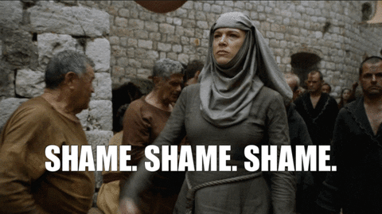
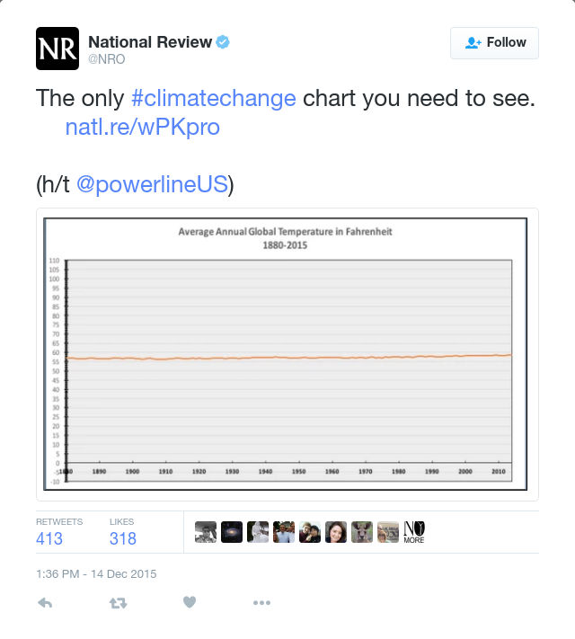
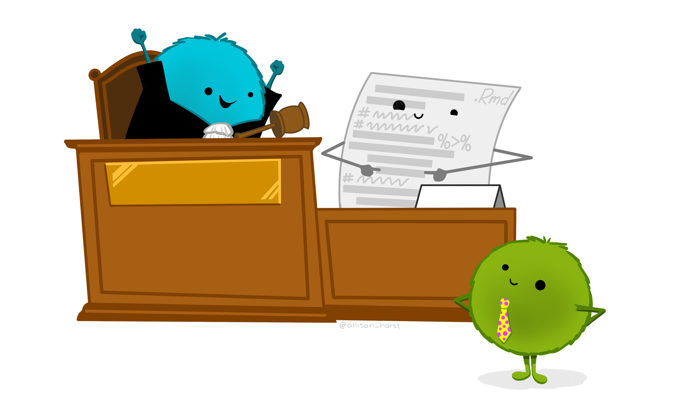

class: center, middle

```{r setup, include = FALSE}
options(htmltools.dir.version = FALSE)
```

```{r xaringan-themer, include = FALSE, warning = FALSE}
library(xaringanthemer)
style_duo_accent(primary_color = "#D83933", 
                 secondary_color = "#00A398",
                 code_font_size = "0.5rem")

# "#f24244"
```

```{r xaringan-logo, echo=FALSE}
library(xaringanExtra)

use_logo(image_url = "ethics_in_data_science_files/CA-Full-Logo-Red-1292x204.png",
         exclude_class = "hide_logo",
         link_url = "https://www.govern4america.org/",
         position = css_position(left = "1em", bottom = "-4.5em"))
```

# Lying with Statistics

"Figures often beguile me, particularly when I have the arranging of them myself; in which case the remark attributed to [then British Prime Minister, Benjamin] Disraeli would often apply with justice and force: 'There are three kinds of lies: lies, damned lies, and statistics.'" - Mark Twain, 1907

---

class: center, middle

# Data Visualization can often be Manipulated for Purpose

---

class: center, middle

# Consider the following line chart. What conclusion do you draw?


---

class: center, middle

# Take a Closer Look at the y-axis

What is really happening?


---

class: center, middle



---

class: center, middle



---

class: center, middle

# Everything Looks Small from Far Away


---

class: center, middle

# COVID is Getting Better?

Look at the dates closely... 


---

class: center, middle


---

class: center, middle

# Some Ethical Conundrums

---

class: left, middle

# Predicting Sexuality

- Y. Wang and Kosinski (2018) used machine learning to build a model that 
predicts sexual orientation based on pictures of people’s faces
- The authors claim that if given **five images of a person’s face**, their 
model would **correctly predict the sexual orientation** of 91% of men and 83% of 
women

---

class: left, middle

# Predicting Sexuality (continued)

1. Was this research ethical? 
2. Were the authors justified in creating and publishing this model?

---

class: left, middle

# Predicting Sexuality (continued)

- The authors highlight the potential harm that their work could do in their 
abstract:
> "Additionally, given that companies and governments are increasingly using computer vision algorithms to detect people’s intimate traits, our findings expose a threat to the privacy and safety of gay men and women."

---

class: left, middle

# Predicting Sexuality (continued)

1. Now was this research ethical? 
2. Does this change your opinion on the justification?

---

class: left, middle

# Predicting Sexuality (continued)

A subsequent article in *The New Yorker* also notes that:
> "the study consisted entirely of white faces, but only because the dating site had served up too few faces of color to provide for meaningful analysis."

---

class: left, middle

# Predicting Sexuality (continued)

1. Now we have more context... how do we feel about the ethics?
2. Were the authors justified in creating and publishing this model?

---

class: left, middle

# Predicting Race

- Imai and Khanna (2016) built a racial prediction algorithm using machine 
learning 
- The model was trained using voter registration records from Florida and the 
U.S. Census Bureau’s name list
- The model returns predicted probabilities for a person’s race based on either 
their last name alone, or their last name and their address

---

class: left, middle

# Predicting Race (continued)

Was the publication of this model ethical? 

---

class: left, middle

# Predicting Race (continued)

In addition to the publishing the paper detailing the methodology, the authors 
published the software for the classifier on GitHub under an open-source license

---

class: left, middle

# Predicting Race (continued)

1. Was the publication of this model ethical? 
2. Does the open-source nature of the code affect your answer? 
3. Is it ethical to use this software? 
4. Does your answer change depending on the intended use?


---

class: center, middle

# Algorithmic Bias



---

class: left, middle

# Algorithmic Bias

- Algorithms are at the core of many data science models
- Biased data may lead to algorithmic bias
- For example: Some groups may be underrepresented or systematically excluded 
from data collection efforts

---

class: left, middle

# Algorithmic Bias Example

- Consider a criminal recidivism algorithm used in several states and detailed in 
a ProPublica story titled “Machine Bias” (Angwin et al. 2016)
- The algorithm returns predictions about how likely a criminal is to commit 
another crime based on a survey of 137 questions

ProPublica claims that the algorithm is biased:

> "Black defendants were still 77 percent more likely to be pegged as at higher risk of committing a future violent crime and 45 percent more likely to be predicted to commit a future crime of any kind."

---

class: center, middle

# Algorithmic Bias Example (continued)

How could the predictions be biased, when the race of the defendants is not 
included in the model?

---

class: left, middle

# Algorithmic Bias Example (continued)

Consider that one of the survey questions is "was one of your parents ever sent 
to jail or prison?"

**Proxy Variable**: a variable that is not in itself directly relevant, but that 
serves in place of an unobservable or immeasurable variable

---

class: left, middle

# Podcast Discussion

1. What shocked you the most from the podcast?
2. Are there places where facial recognition may be beneficial?
3. What do you think about consent and facial recognition?
4. How do we fix the issues from the podcast?

---

class: left, middle

# Additional Resources

.pull-left[
Some great books outlining the issue(s):

- [Weapons of Math Destruction](https://www.amazon.com/Weapons-Math-Destruction-Increases-Inequality-ebook/dp/B019B6VCLO/)
- [Algorithms of Oppression](https://www.amazon.com/Algorithms-Oppression-Search-Engines-Reinforce-ebook/dp/B075XS7Y7D/ref=sr_1_1)
- [Artificial Unintelligence](https://www.amazon.com/Artificial-Unintelligence-Computers-Misunderstand-World-ebook/dp/B08BT23822/ref=sr_1_1)
- [Artificial Intelligence](https://www.amazon.com/Artificial-Intelligence-Guide-Thinking-Humans-ebook/dp/B07MYWPQSK/ref=sr_1_1)
- [Superintelligence](https://www.amazon.com/Superintelligence-Dangers-Strategies-Nick-Bostrom-ebook/dp/B00LOOCGB2/ref=sr_1_1)
- [The Hype Machine](https://www.amazon.com/Hype-Machine-Disrupts-Elections-Health-ebook/dp/B083RZKJY3/ref=sr_1_1)
- [The Alignment Problem](https://www.amazon.com/Alignment-Problem-Machine-Learning-Values-ebook/dp/B085T55LGK/ref=sr_1_2)
- [The Loop](https://www.amazon.com/Loop-Technology-Creating-Without-Choices-ebook/dp/B093ZQ5ZWX/ref=sr_1_1)
]

.pull-right[
One book that I've found that gets a bit into the potential solutions:

- [The Ethical Algorithm](https://www.amazon.com/Ethical-Algorithm-Science-Socially-Design-ebook/dp/B07XLTXBXV/ref=sr_1_1)

Podcasts:

- [My, Myself, and AI](https://sloanreview.mit.edu/audio-series/me-myself-and-ai/)
- [Your Undivided Attention](https://www.humanetech.com/podcast)
- [In Machines We Trust](https://forms.technologyreview.com/in-machines-we-trust/)

Documentaries:

- [Coded Bias](https://www.codedbias.com/)
- [The Social Dilemma](https://www.thesocialdilemma.com/)
]
